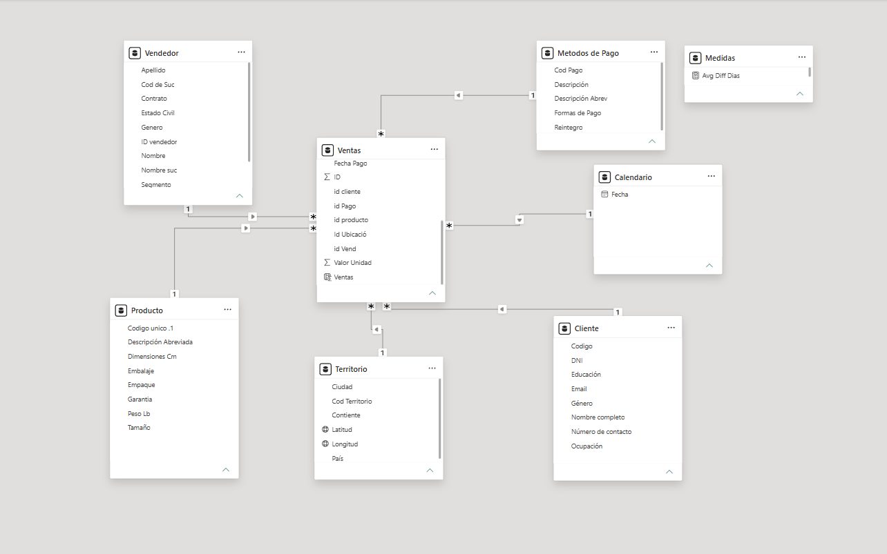

# 02. Modelo de Datos

## Arquitectura

El modelo de datos fue diseñado utilizando un **Star Schema (Esquema Estrella)** en Power BI.

La tabla de hechos `Ventas` se encuentra en el centro del modelo y está relacionada directamente con seis tablas de dimensiones:

* `Vendedor`
* `Producto`
* `Territorio`
* `Cliente`
* `Calendario`
* `Metodos de Pago`

Además, el modelo incluye la tabla `Medidas`, utilizada como contenedor independiente para las medidas DAX.

La estructura permite analizar las transacciones de ventas desde diferentes perspectivas, manteniendo relaciones simples y una propagación de filtros controlada.

## Vista del modelo

## Tabla de hechos

### Ventas

`Ventas` es la tabla de hechos principal del modelo. Contiene los registros transaccionales y las métricas utilizadas para el análisis.

Campos principales:

* `ID`
* `id producto`
* `id cliente`
* `Id Ubicació`
* `id Pago `
* `id Vend `
* `Fecha compra`
* `Fecha Entrega`
* `Fecha Pago `
* `Valor Unidad`
* `Cantidad `
* `Ventas`
* `Costos`
* `Costos Directos `
* `Costos Indirectos`
* `Diferencia de Dias`
* `Categoria`

Las columnas identificadoras permiten vincular cada registro de venta con las dimensiones correspondientes.

## Tablas de dimensiones

### Cliente

Contiene información descriptiva de los clientes.

Campos:

* `Codigo`
* `DNI`
* `Nombre completo`
* `Número de contacto `
* `Email `
* `Género`
* `Ocupación`
* `Educación`

Permite segmentar las ventas según las características de los clientes.

### Producto

Contiene información descriptiva de los productos.

Campos:

* `Codigo unico .1`
* `Descripción Abreviada`
* `Tamaño`
* `Empaque`
* `Embalaje`
* `Garantia`
* `Peso Lb`
* `Dimensiones Cm`

Permite analizar ventas y costos según las características de los productos.

### Vendedor

Contiene información de los vendedores y sus características comerciales.

Campos:

* `ID vendedor`
* `Nombre`
* `Apellido`
* `Genero`
* `Telefono`
* `Estado Civil`
* `Contrato`
* `Cod de Suc`
* `Nombre suc`
* `Segmento`
* `Zona`

Permite analizar el desempeño comercial según vendedor, sucursal, segmento y zona.

### Territorio

Contiene información geográfica.

Campos:

* `Cod Territorio`
* `País`
* `Contiente`
* `Ciudad`
* `Latitud`
* `Longitud`

Permite segmentar las ventas geográficamente y alimentar las visualizaciones de mapas.

> `Contiente` mantiene el nombre actual del campo en el modelo.

### Metodos de Pago

Contiene información sobre los medios de pago.

Campos:

* `Cod Pago`
* `Descripción`
* `Descripción Abrev`
* `Formas de Pago`
* `Reintegro`

Permite analizar las ventas según el método de pago utilizado.

### Calendario

La tabla `Calendario` contiene el campo:

* `Fecha`

Funciona como dimensión temporal del modelo.

## Relaciones del modelo

Todas las dimensiones se relacionan directamente con `Ventas` mediante relaciones de **uno a muchos (`1:*`)**.

| Tabla origen      | Columna origen    | Tabla destino | Columna destino | Cardinalidad | Dirección | Activa |
| ----------------- | ----------------- | ------------- | --------------- | ------------ | --------- | ------ |
| `Vendedor`        | `ID vendedor`     | `Ventas`      | `id Vend `      | `1:*`        | Única     | Sí     |
| `Producto`        | `Codigo unico .1` | `Ventas`      | `id producto`   | `1:*`        | Única     | Sí     |
| `Territorio`      | `Cod Territorio`  | `Ventas`      | `Id Ubicació`   | `1:*`        | Única     | Sí     |
| `Cliente`         | `Codigo`          | `Ventas`      | `id cliente`    | `1:*`        | Única     | Sí     |
| `Calendario`      | `Fecha`           | `Ventas`      | `Fecha Pago `   | `1:*`        | Única     | Sí     |
| `Metodos de Pago` | `Cod Pago`        | `Ventas`      | `id Pago `      | `1:*`        | Única     | Sí     |

La dirección de filtro cruzado es **Única**, desde las dimensiones hacia `Ventas`.

No existen relaciones muchos a muchos ni relaciones bidireccionales en el modelo.

## Gestión de fechas

La tabla `Ventas` contiene tres campos relacionados con fechas:

* `Fecha compra`
* `Fecha Entrega`
* `Fecha Pago `

La relación activa con `Calendario` utiliza:

`Calendario[Fecha]` → `Ventas[Fecha Pago ]`

Por lo tanto, los análisis temporales principales del dashboard se basan en la **fecha de pago**.

## Tabla de medidas

El modelo incluye una tabla independiente denominada `Medidas`.

Esta tabla no tiene relaciones con las demás tablas y funciona como contenedor para centralizar los cálculos DAX.

Medidas creadas:

* `Avg Diff Dias`
* `Cant Unidades Vendidas`
* `Costos Totales`
* `Rentabilidad`
* `Ventas Totales`

Separar las medidas en una tabla específica facilita la organización y el mantenimiento del modelo.

## Distribución en la Vista Modelo

La disposición de las tablas en el lienzo fue organizada alrededor de `Ventas` para facilitar la lectura visual del modelo.

* **Centro:** `Ventas`, tabla de hechos principal.
* **Superior izquierda:** `Vendedor`.
* **Inferior izquierda:** `Producto`.
* **Superior derecha:** `Metodos de Pago`.
* **Derecha central:** `Calendario`.
* **Inferior derecha:** `Cliente`.
* **Inferior central:** `Territorio`.
* **Separada del modelo:** `Medidas`, tabla independiente para las medidas DAX.

## Resultado del modelado

El modelo permite analizar las métricas de `Ventas` combinando diferentes dimensiones:

* **Tiempo:** `Calendario`
* **Clientes:** `Cliente`
* **Productos:** `Producto`
* **Vendedores:** `Vendedor`
* **Geografía:** `Territorio`
* **Métodos de pago:** `Metodos de Pago`

La utilización de un **Star Schema**, relaciones `1:*` y filtros unidireccionales proporciona una estructura clara para la construcción de los dashboards y facilita el análisis de las ventas desde diferentes perspectivas.

