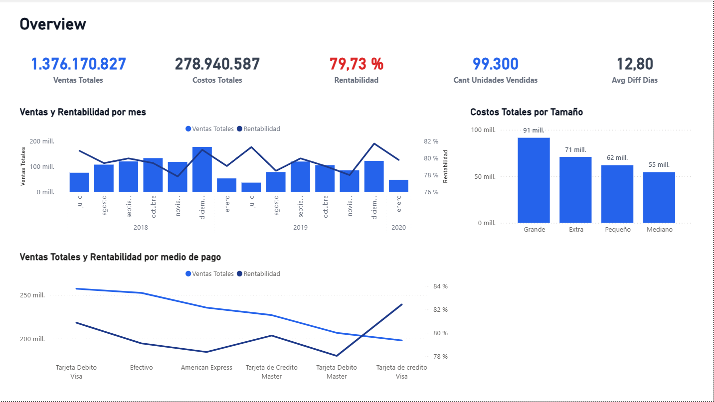
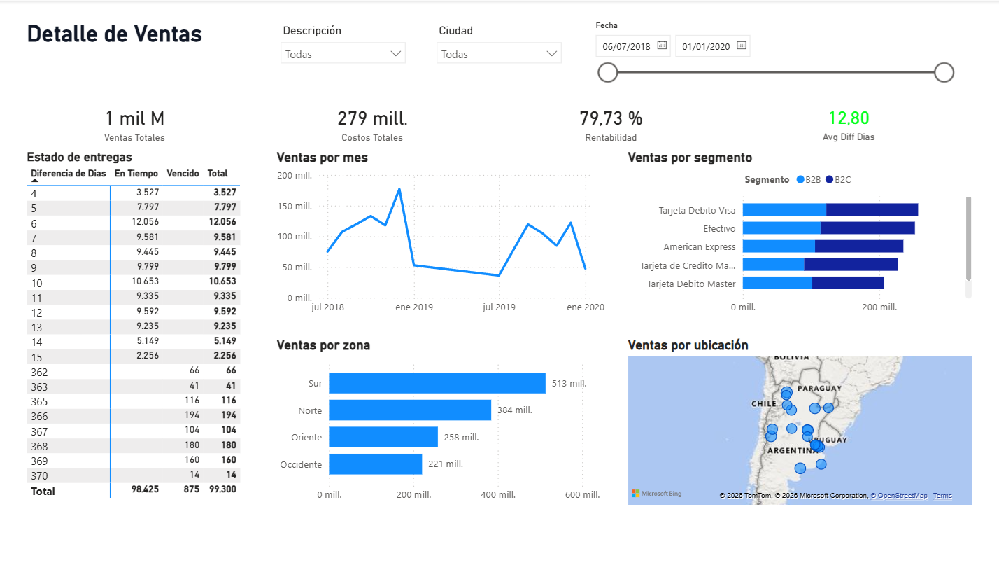

# Sales Analytics – Power BI

## Descripción

Proyecto de análisis de ventas desarrollado en Power BI, orientado al análisis de ventas, costos, rentabilidad, distribución geográfica y cumplimiento de entregas.

## Objetivo

Construir un dashboard interactivo que permita analizar el desempeño comercial desde diferentes perspectivas: tiempo, cliente, producto, vendedor, territorio y método de pago.

## Datos y transformación

El proyecto utiliza tres fuentes de datos de práctica:

* Archivo Excel con información de ventas, clientes, productos y vendedores.
* Archivo PDF con métodos de pago.
* Archivo TXT con información territorial.

Los datos fueron preparados y transformados mediante **Power Query**, realizando limpieza de registros, modificación de tipos de datos, eliminación de columnas innecesarias, corrección de valores y transformación de códigos.

## Modelo y DAX

Se construyó un modelo de datos basado en un **Star Schema**, con `Ventas` como tabla de hechos y las dimensiones `Cliente`, `Producto`, `Vendedor`, `Territorio`, `Metodos de Pago` y `Calendario`.

Se desarrollaron medidas DAX para analizar:

* Ventas Totales
* Costos Totales
* Rentabilidad
* Cantidad de Unidades Vendidas
* Promedio de Diferencia de Días

## Dashboard

### Overview

### Detalle de Ventas

## Insights principales

* **Cumplimiento de entregas:** 98.425 operaciones se encuentran en tiempo frente a 875 vencidas, sobre un total de 99.300 operaciones.
* **Ventas por zona:** la zona Sur lidera las ventas con $513 M, seguida por Norte ($384 M), Oriente ($258 M) y Occidente ($221 M).
* **Evolución temporal:** las ventas presentan un comportamiento fluctuante, con patrones estacionales y períodos de mayor y menor actividad comercial.
* **Costos por tamaño:** los productos de tamaño Grande presentan el mayor nivel de costos ($91 M), mientras que los de tamaño Mediano presentan el menor ($55 M).
* **Rentabilidad:** el dashboard muestra una rentabilidad global de 79,73 %, con ventas totales de $1.376.170.827 y costos totales de $278.940.587.

## Herramientas

**Power BI · Power Query · DAX**
